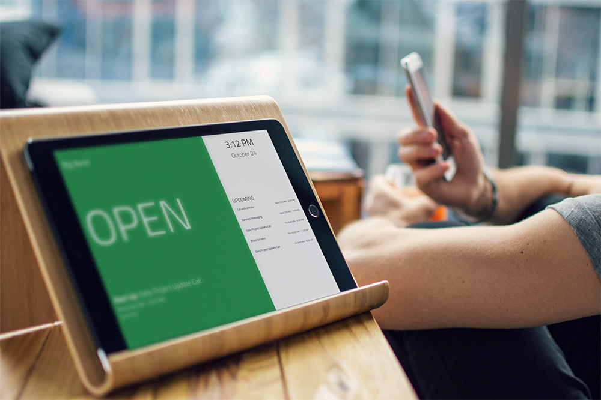
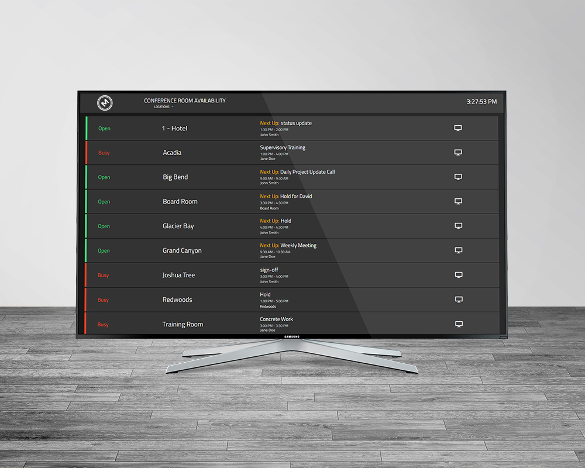

# MeetEasier

Because why pay money for something you can do yourself?

## Description

MeetEasier is a web application that visualizes meeting room availability.  It works using Exchange Web Services (EWS) with Exchange room lists and Office365.



***

## To Use

1. *Optional*: Install IISNode
    * I've also included a `web.config` file for an IIS install
2. In root directory, open a terminal or cmd:
    ```bash
    $ npm install
    ```
3. Navigate to `ui-react/`. In the `package.json` file, change:
    ```
    "proxy" : "http://localhost:8080"
    ```
    to whatever the IP of where express is running.  Typically you can use something similar to the default but you can change the IP and port as long as it coincides with what is in `server.js`.
4. In `ui-react/`, open a terminal or cmd:
    ```
    $ npm install
    $ npm run build
    ```
5. In the root directory, open a terminal or cmd:
    ```
    $ node server.js
    ```
6. If you want to start the react development server, in `ui-react/` run:
    ```
    $ npm start
    ```

***

## Root Folder Structure Explained

* `app/` : Routes for EWS APIs
* `config/` : All EWS functionality
* `scss/` : All styles
* `static/` : All global static files
* `ui-react/` : Front end React routes and components

***

## React /src Folder Structure Explained

There are three main directories in the `ui-react/src/` folder:

* `components/` : Components separated in folders by function
* `config/` : Customizable config file (see defails below in Customization section)
* `layouts/` : Layout components for the two different layouts used.

***

### components/

Within `components/`, each component itself is structure by it's use:

* `flightboard/` : All components related to the flightboard or "all meeting" layout
* `global` : Components that will be used by both layouts
* `single-room` : All components related to the Single Room layout

#### components/flightboard/

Within the `components/flightboard/` folder, each individual component is broken out:

* `board/` : Actual flightboard component itself
* `clock/` : Clock component for the upper right hand of the display
* `navbar/` : Top navigation/title bar piece
* `room-filter/` : Room list filter in the navbar

#### components/global/

Within the `components/global/` folder, each global component is broken out:

* `not-found/` : A "not found" page if an error or "404" occurs
* `socket/` : Work in progress

#### components/single-room/

* `clock/` : Clock component for the upper right hand of the display
* `display/` : All other features of the single room display

***

### config/

Within the `config/` folder is one single config file:

`flightboard.config.js` : Simple customization config explained in the Customization section

***

### Layouts

Within the `layouts/` folder are two layout components:

`flightboard/` : Layout for flightboard display
`single-room/` : Layout for single room display

***

## Customization

### Simple

* In `/config/auth.js`, enter your credentials and domain:

    ```javascript
    module.exports = {
      // this user MUST have full access to all the room accounts
      'exchange' : {
        'username'  : 'SVCACCT_EMAIL@DOMAIN.COM',
        'password'  : 'PASSWORD',
        'uri'       : 'https://outlook.office365.com/EWS/Exchange.asmx'
      },
      'domain' : 'DOMAIN'
    };
    ```

* In `/ui-react/src/config/flightboard.config.js`, manage your customizations:

    ```javascript
    module.exports = {
        'title' : 'Conference Room Availability',
        'filterTitle' : 'Locations',
        'filterAllTitle' : 'All Conference Rooms',
        'roomsToSkip' : [
          'ROOM_EMAIL@DOMAIN.COM'
        ],
        'socketEndpoint' : 'http://localhost:8080'
    };
    ```

* Upload your logo to `/static/img/logo.png`

### Advanced

* All EWS functionality is located in `config/ews`.
* If you'd like to change the interval in which the web socket emits, change the interval time in `config/controller.js`.  By default, it is set to 1 minute.
* To updated styles, make sure you install grunt first with `npm install -g grunt-cli`.  Then run `grunt` in the root directory to watch for SCSS changes.  Use the `.scss` files located in the `/scss` folder.
  * All React components can be locally styled by adding a new `.css` file and importing it into the component itself if you'd prefer to do it that way.
* In `config/ews/rooms.js`, there is a block of code on lines 37-39 that may not be necessary but were added as a convenience.  Feel free to use it, comment it out, or remove it completely.  It was designed for a use case where the email addresses (ex: jsmith@domain.com) do not match the corporate domain of jsmith-enterprise.
    ```javascript
    // if the email domain != your corporate domain,
    // replace email domain with domain from auth config
    var email = roomItem.Address;
    email = email.substring(0, email.indexOf('@'));
    email = email + '@' + auth.domain + '.com';
    ```

***

## Flightboard Layout Mockup



## Single Room Layout Mockup


***

## Resources & Attributions

* [ews-javascript-api](https://github.com/gautamsi/ews-javascript-api)
* Mockup Images:
  * https://www.anthonyboyd.graphics/mockups/2017/realistic-ipad-pro-mockup-vol-3/
  * https://www.freepik.com/free-psd/business-meeting-with-tv-mockup_1163371.htm
  * https://www.freepik.com/free-psd/samsung-tv-mockup_800771.htm
